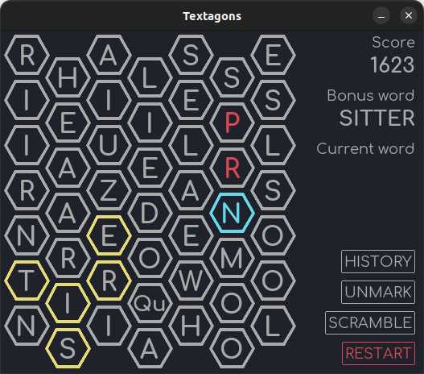

# Textagons ⬢ ⬡
This is a Pygame implementation of the classic Flash game "Bookworm" by PopCap. Click neighboring tiles to spell words, clicking the last selected tile to submit a word. Spell the **Bonus word** for a score multiplier.

### Changes to the original game
* No level multipliers; I feel like these made the game a bit of a grind to get to a level where you're actually accumulating real points.
* Hexagons instead of staggered square tiles. Because BattleTech, probably.
* A better dictionary.
* Right click a tile to mark it. This makes it easy to keep track of tiles you want to save for future bonus words.
* Only 1 bonus tile type: blue/crystal. Find a word of five letters or more for a chance to create one; the longer the word, the better the chance (5: 10% ... >=9: 100%).

### Thanks to
* Burak Karaca on ArtStation for [inspiration](https://www.artstation.com/artwork/Lemkll)
* Johan Aakerlund for [the "Comfortaa" font](https://www.dafont.com/comfortaa.font)

### TODO
* Add fire tiles & logic
* "Clear all marked" button
* Click-and-drag to select tiles, release to submit
* Show word history?
* Show best/longest word?
